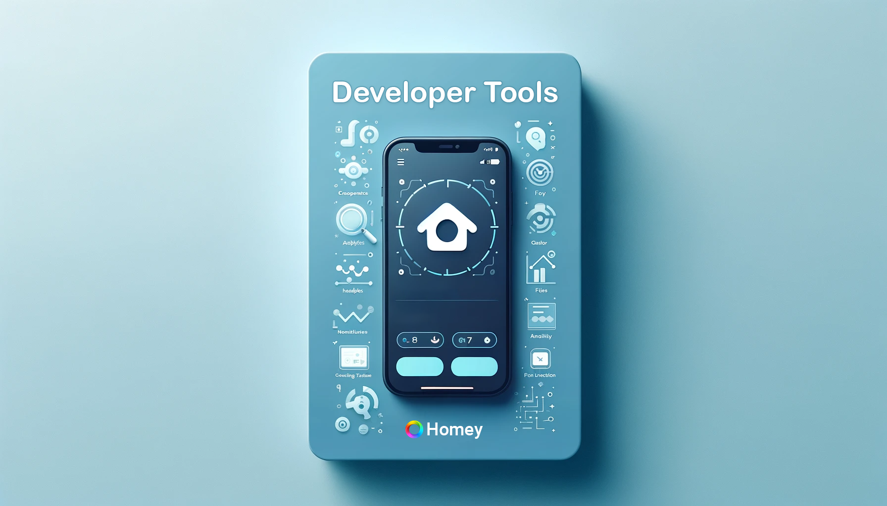

# Hey Devs, Get More from Your Homey Apps!

**Say hello to the Developer Tools app for Homey — your new best friend in automating actions in your homey app development.**

This isn't just another app. It's your personal backstage pass to hooking up your own apps with Homey. Want to automate like a boss? Check out how your apps play in real-time with Homey flows, get insights on installs, handle crashes, and more.

Here's what you can do with Developer Tools:
- Set up triggers for new app installs, sad crashes (yes, they happen) or failed reviews.
- Create conditions in flows to keep an eye on your app's pulse.
- Take actions based on what's up with your apps.

Ready to make your Homey development smarter? Let's get rolling with Developer Tools!

| What's Cool | Description | Links                                                                         | Visuals                                                                                                                                                                                                                   |
|-------------|-------------|-------------------------------------------------------------------------------|---------------------------------------------------------------------------------------------------------------------------------------------------------------------------------------------------------------------------|
| **Homey App Store** | Need this tool? Just a click away. | [Get it here](https://homey.app/a/codes.lucasvdh.developer-tools) |                                                                                                                                                                         |
| **Source Code** | Peek under the hood on Github. | [Show me the code](https://github.com/lucasvdh/codes.lucasvdh.developer-tools) |  |

## The Fine Print
Alright, the Developer Tools app for Homey is by devs, for devs, and it hasn't got the official Athom stamp. But hey, it's built to give you an extra edge on your Homey app development journey.

Got ideas or wanna squash bugs? Jump in and contribute to make it even better for all Homey devs out there!
